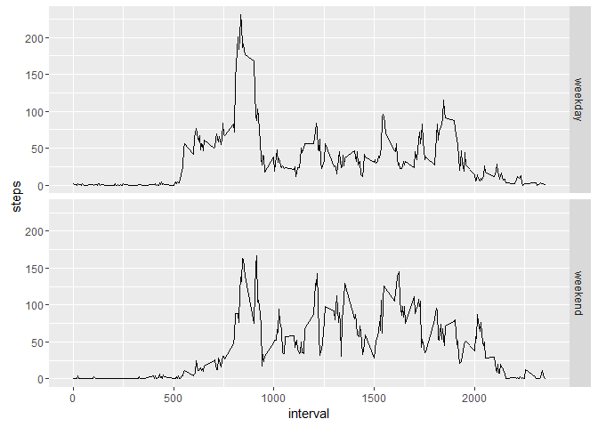

# Reproducible Research: Peer Graded Assignment: Course Project 1
#####Elena Badillo

### Load Data
First, we'll load  the activity dataset from ourworking directory into R:

```r
if(!file.exists("./pro1")){dir.create("./pro1")} #Creates new folder if necessary 

unzip(zipfile="C:/Users/G13519/Downloads/repdata%2Fdata%2Factivity.zip",exdir="./pro1")

amd<- read.csv("./pro1/activity.csv")
```
And we'll set some global options that we'll need throught the presentation:

```r
library(ggplot2)
library(plyr)
```
### What is mean total number of steps taken per day?


Then, we'll calculate the total number of steps taken per day, showing a histogram:


```r
stepsD<-split(amd$steps,amd$date)
totalD<-as.numeric(sapply(stepsD,sum, na.rm=TRUE))
qplot(totalD, binwidth=1000, xlab = "Total steps per day")
```

<!-- -->

Let's calculate the mean and median of the total number of steps taken per day:


```r
 meanD<-mean(totalD)
 meanD
```

```
## [1] 9354.23
```

```r
 medianD<-median(totalD)
 medianD
```

```
## [1] 10395
```

### What is the average daily activity pattern?

To illustrate this we'll make a time series plot of the 5-minute interval (x-axis) and the average number of steps taken (y-axis), averaged across all days:

```r
 stepsInt<-split(amd$steps,amd$interval)
 meanInt<-as.numeric(sapply(stepsInt,mean, na.rm=TRUE))
 int<-as.numeric(levels(as.factor(amd$interval)))
 
 ggplot(data=NULL, aes(int, meanInt)) + geom_line()
```

<!-- -->

Which 5-minute interval, on average across all the days in the dataset, contains the maximum number of steps?


```r
xInt<-data.frame(cbind(int,meanInt))
maxInt<-xInt$int[[as.numeric(which.max(xInt$meanInt))]]
maxInt
```

```
## [1] 835
```

###Imputing missing values

Let's calculate  the total number of missing values in the dataset (i.e. the total number of rows with NAs):


```r
NAm<-na.omit(amd)
total.NA<-as.numeric(nrow(amd)-nrow(NAm))
total.NA
```

```
## [1] 2304
```

Now, in order to fill in all of the missing values in the dataset, we'll use  the mean for  that 5-minute interval:


```r
amd2<-amd
 for (i in 1: nrow(amd2)) {
     if (is.na(amd2$steps[[i]])){
         amd2$steps[[i]]<-xInt$meanInt[[match(amd2$interval[[i]],xInt$int)]]}
     else { amd2$steps[[i]]<-amd2$steps[[i]]}
 }
```

Let's remake the previous histogram (of the total number of steps taken each day) and re-calculate the mean and median total number of steps taken per day, with the new dataset with filled NAs.


```r
 stepsD2<-split(amd2$steps,amd2$date)
 totalD2<-as.numeric(sapply(stepsD2,sum, na.rm=TRUE))
 
 qplot(totalD, binwidth=1000, xlab = "Total steps per day")
```

<!-- -->

```r
 mean2<-mean(totalD2)
 medianD2<-median(totalD2)
 mean2
```

```
## [1] 10766.19
```

```r
 medianD2
```

```
## [1] 10766.19
```


We can see that both the new mean and median are now higher because in the original dataset all the missing values were replaced by zero, which lowered these variables.

###Are there differences in activity patterns between weekdays and weekends?

With the new filled dataset, let's make a panel plot containing a time series plot of the 5-minute interval (x-axis) and the average number of steps taken, averaged across all weekday days or weekend days (y-axis). This will tell us if there are different activity patters between weekdays and weekends:


```r
  wd<-factor(c("weekday", "weekend"))

  wday.or.wend<-function(date){
     d<-weekdays(date)
 if (d %in% c("lunes","martes","miércoles","jueves","viernes"))
     return("weekday") else if (d %in% c("sábado","domingo"))
         return("weekend") else stop("invalid date")
 }
 
 amd2$weekday<-as.Date(amd2$date)
 amd2$d<-sapply(amd2$weekday,FUN=wday.or.wend)

 meanIntWDays <- aggregate(steps ~ interval + d, data = amd2, mean)
 
 ggplot(meanIntWDays, aes(interval, steps)) + geom_line() + facet_grid(d~.)
```

<!-- -->

We can notice slighly higher activity levels throughout weekends, but higher activity levels in the morning on weekdays. 

